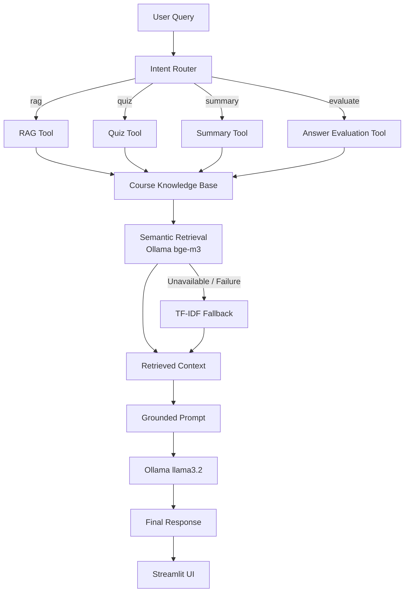

# LearnPilot AI — Agentic AI Learning Assistant

**LearnPilot AI** is a course-grounded AI learning assistant that extends a traditional Retrieval-Augmented Generation (RAG) system into a multi-capability learning workflow.

Instead of following a single `query → retrieve → generate` pipeline, LearnPilot AI first determines the user's intent and routes the request to a task-specific tool for:

* 📚 **RAG-based Q&A**
* 📝 **Quiz generation**
* 📖 **Lecture summarization**
* ✅ **Answer evaluation**

The project intentionally uses a lightweight, explicit agent architecture rather than hiding the orchestration behind a large agent framework. This makes the workflow easier to understand, test, debug, and extend.

---

## ✨ Features

* **Intent-based tool routing** for four learning capabilities
* **Course-grounded responses** using lecture transcript data
* **Semantic retrieval** using Ollama `bge-m3` embeddings
* **TF-IDF fallback retrieval** when semantic retrieval is unavailable
* **Cosine similarity ranking** for semantic search
* **Source-aware responses** with lecture metadata and timestamps
* **Task-specific grounded prompts**
* **Local LLM inference** using Ollama `llama3.2`
* **Streaming responses** in the Streamlit interface
* **Explicit agent state** for transparent workflow execution
* **Modular tool registry** for easy extension
* **Unit tests** for routing, retrieval-related behavior, tool construction, and agent orchestration
* **Git LFS support** for the embedding artifact

---

# 🎯 Why LearnPilot AI?

A basic RAG application usually follows:

```text
User Query
    ↓
Retrieve Context
    ↓
Generate Answer
```

This works well for question answering, but learning applications require different types of interactions.

For example:

```text
"Explain the CSS box model"
        → Q&A

"Give me 10 MCQs on CSS selectors"
        → Quiz

"Summarize the semantic HTML lecture"
        → Summary

"Check whether my answer is correct"
        → Evaluation
```

LearnPilot AI adds an explicit decision layer:

```text
User Query
    ↓
Intent Router
    ↓
Select Capability
    ↓
Retrieve Course Context
    ↓
Execute Tool
    ↓
Generate Grounded Response
```

This allows a single course knowledge base to support multiple learning workflows.

---

# 🏗️ Architecture



---

# 🔄 End-to-End Pipeline

## 1. Course Data Processing

Course lectures are converted into structured transcript data.

```text
Course Videos
     ↓
Audio Extraction
     ↓
Whisper
     ↓
English Transcript
     ↓
Timestamped JSON Chunks
     ↓
Embedding Generation
     ↓
Knowledge Base
```

Each transcript chunk preserves information such as:

```text
Video Number
Video Title
Start Timestamp
End Timestamp
Transcript Text
```

This metadata allows the system to associate retrieved information with the original course lecture.

---

# 🤖 Agent Layer

The agent workflow is implemented directly in Python.

It consists of:

### Intent Router

The router identifies one of four supported capabilities:

```text
rag
quiz
summary
evaluate
```

### Agent State

The workflow maintains information such as:

```text
Query
Intent
Retrieved Context
Selected Tool
Tool Result
Final Response
```

### Tool Registry

The selected intent is mapped to the corresponding tool through a centralized tool registry.

The overall workflow is:

```text
Query
  ↓
Intent Detection
  ↓
Course Retrieval
  ↓
Tool Selection
  ↓
Task-Specific Prompt
  ↓
LLM Generation
  ↓
Final Response
```

The orchestration is intentionally explicit instead of relying on a large agent framework.

---

# 🧠 Supported Learning Tools

## 1. RAG — Course Q&A

Example:

```text
Explain the CSS box model from my course material.
```

The system retrieves relevant lecture content and generates a grounded answer using that context.

---

## 2. Quiz Generation

Example:

```text
Give me 10 MCQs on CSS selectors.
```

The quiz tool generates questions using the retrieved course material.

The generated quiz can include:

* Multiple-choice options
* Correct answer
* Short explanation

---

## 3. Lecture Summarization

Example:

```text
Summarize the lecture on semantic HTML.
```

The system retrieves relevant lecture sections and generates a concise course-grounded summary.

---

## 4. Answer Evaluation

Example:

```text
Check my answer: the CSS box model only contains the content area.
```

The evaluation tool uses the retrieved course material to assess the student's answer and provide an explanation.

---

# 🔎 Retrieval Layer

LearnPilot AI supports two retrieval strategies.

## Semantic Retrieval

When Ollama and the embedding model are available:

```text
User Query
    ↓
bge-m3 Embedding
    ↓
Cosine Similarity
    ↓
Ranked Transcript Chunks
```

The project uses:

```text
Embedding Model: bge-m3
```

Semantic retrieval allows the system to retrieve conceptually related content even when the exact words in the query do not appear in the transcript.

---

## TF-IDF Fallback

If semantic retrieval is unavailable, the system can fall back to TF-IDF retrieval:

```text
User Query
    ↓
TF-IDF Representation
    ↓
Similarity Calculation
    ↓
Ranked Transcript Chunks
```

This provides a lightweight retrieval fallback instead of making the entire application dependent on the embedding service.

---

# 📚 Knowledge Base

The project uses an existing `embeddings.joblib` artifact containing the processed course knowledge base.

The repository also contains transcript JSON files that can be used to rebuild the embedding artifact.

The knowledge base preserves lecture metadata such as:

```text
Video Number
Video Title
Start Time
End Time
Transcript Text
```

This enables source-aware responses and makes it possible to identify where retrieved information came from within the course.

---

# 🧩 Generation Layer

The project uses Ollama for local LLM inference.

Default models:

```text
Embedding Model → bge-m3
LLM             → llama3.2
```

The generation pipeline is:

```text
Retrieved Course Context
        +
User Request
        +
Task-Specific Instructions
        ↓
Grounded Prompt
        ↓
Ollama llama3.2
        ↓
Response
```

The prompts explicitly instruct the model to prioritize the supplied course material and avoid inventing unsupported course information.

---

# ⚡ Streaming Responses

LearnPilot AI supports streaming responses in the Streamlit interface.

Instead of waiting for the complete response:

```text
Request
   ↓
Wait
   ↓
Complete Response
```

the UI can display the generated response progressively:

```text
Request
   ↓
Token / Chunk
   ↓
Token / Chunk
   ↓
Token / Chunk
   ↓
Final Response
```

This improves the perceived responsiveness of the application.

---

# 🖥️ User Interface

The application uses **Streamlit** and provides:

* Chat-based interaction
* Quick learning prompts
* Configurable retrieval settings
* Streaming responses
* Retrieved source information
* Lecture metadata
* Retrieval scores
* Ollama configuration options

Example workflow:

```text
Student
   ↓
Ask a question
   ↓
Intent detection
   ↓
Retrieve relevant lecture content
   ↓
Generate grounded response
   ↓
Display answer + sources
```

---

# 📁 Project Structure

```text
LearnPilot-AI/
│
├── agent/
│   ├── graph.py
│   ├── router.py
│   ├── state.py
│   ├── tools.py
│   └── evaluation.py
│
├── retrieval/
│   ├── retriever.py
│   └── prompts.py
│
├── llm/
│   └── ollama.py
│
├── jsons/
│   └── course transcript JSON files
│
├── tests/
│   └── unit and workflow tests
│
├── app.py
├── config.py
├── preprocess_json.py
├── process_incoming.py
├── embeddings.joblib
├── requirements.txt
└── README.md
```

---

# ⚙️ Installation

## 1. Clone the repository

```bash
git clone https://github.com/Anshul-Rajpoot/LearnPilot-AI.git
cd LearnPilot-AI
```

## 2. Create a virtual environment

### Windows

```bash
python -m venv .venv
.venv\Scripts\activate
```

### macOS / Linux

```bash
python -m venv .venv
source .venv/bin/activate
```

## 3. Install dependencies

```bash
pip install -r requirements.txt
```

---

# 🦙 Install and Configure Ollama

Install Ollama separately and make sure the Ollama service is running.

Pull the required models:

```bash
ollama pull bge-m3
ollama pull llama3.2
```

Start the Ollama service if required:

```bash
ollama serve
```

---

# 📦 Knowledge Base Setup

The repository's `embeddings.joblib` file is managed using **Git LFS**.

After cloning the repository:

```bash
git lfs install
git lfs pull
```

If the embedding artifact is unavailable, it can be rebuilt from the transcript JSON files:

```bash
python preprocess_json.py
```

The preprocessing script requires the `bge-m3` Ollama model.

---

# ▶️ Run the Application

Start the Streamlit application:

```bash
streamlit run app.py
```

The application will then be available through the Streamlit development server.

---

# 💬 Example Queries

### Course Q&A

```text
Explain the CSS box model from my course material.
```

### Quiz

```text
Give me 10 MCQs on CSS selectors.
```

### Summary

```text
Summarize the lecture on semantic HTML.
```

### Answer Evaluation

```text
Check my answer: the CSS box model only contains the content area.
```

---

# 🔧 Configuration

The application can be configured using environment variables.

```text
OLLAMA_BASE_URL=http://localhost:11434
OLLAMA_EMBEDDING_MODEL=bge-m3
OLLAMA_LLM_MODEL=llama3.2
OLLAMA_TIMEOUT=300
```

Defaults are provided in the project configuration, so these variables are optional unless customization is required.

---

# 🧪 Testing

Run the test suite with:

```bash
python -m pytest -q
```

The tests cover important parts of the system, including:

* Intent routing
* Tool prompt construction
* Agent orchestration
* Fake retriever based workflow testing
* Retrieval-related behavior
* Ollama error handling

The goal is to keep the individual components independently testable rather than testing only the Streamlit interface.

---

# 🧠 Important Design Decisions

## Why not LangGraph?

The current workflow is intentionally implemented directly in Python.

```text
Router
  ↓
Retrieve
  ↓
Select Tool
  ↓
Generate
```

This keeps the orchestration:

* Easy to inspect
* Easy to debug
* Easy to test
* Lightweight
* Free from unnecessary framework complexity

LangGraph could be introduced later if the system requires more complex graph execution, persistent state, retries, human-in-the-loop workflows, or more sophisticated branching.

---

## Why Ollama?

Ollama provides local model execution, allowing the project to run without depending on a hosted LLM API for its core generation and embedding workflow.

This is useful for:

* Local development
* Privacy-sensitive course material
* Offline or limited-connectivity environments
* Experimentation with different open models

---

## Why semantic retrieval + TF-IDF?

Semantic retrieval is better suited to conceptual questions because related ideas can be retrieved even when exact keywords differ.

TF-IDF provides a simpler lexical retrieval mechanism that can act as a fallback when the semantic embedding pipeline is unavailable.

Therefore:

```text
Primary:
Semantic Retrieval

Fallback:
TF-IDF Retrieval
```

---

# 📊 Current Architecture at a Glance

```text
                ┌─────────────────────┐
                │     User Query      │
                └──────────┬──────────┘
                           ↓
                ┌─────────────────────┐
                │    Intent Router    │
                └──────────┬──────────┘
                           ↓
       ┌───────────────────┼───────────────────┐
       ↓                   ↓                   ↓
      RAG                Quiz              Summary
       │                   │                   │
       └───────────────────┼───────────────────┘
                           ↓
                    Course Retrieval
                           ↓
                 ┌─────────┴─────────┐
                 ↓                   ↓
          bge-m3 Semantic         TF-IDF
             Retrieval           Fallback
                 └─────────┬─────────┘
                           ↓
                    Retrieved Context
                           ↓
                   Grounded Prompt
                           ↓
                     llama3.2 LLM
                           ↓
                    Streamlit UI
```

---

# 🚀 Future Improvements

Possible extensions include:

* Query rewriting before retrieval
* Cross-encoder or LLM-based reranking
* Multi-intent request handling
* Conversational memory
* Personalized learning profiles
* Quiz performance tracking
* Topic-wise weakness detection
* Persistent student progress
* Retrieval evaluation using metrics such as Recall@K and MRR
* Answer faithfulness evaluation
* Larger-scale vector indexing
* Authentication and multi-user support
* Human-in-the-loop evaluation
* More sophisticated agent workflows

These are potential future directions rather than features currently claimed as implemented.

---
