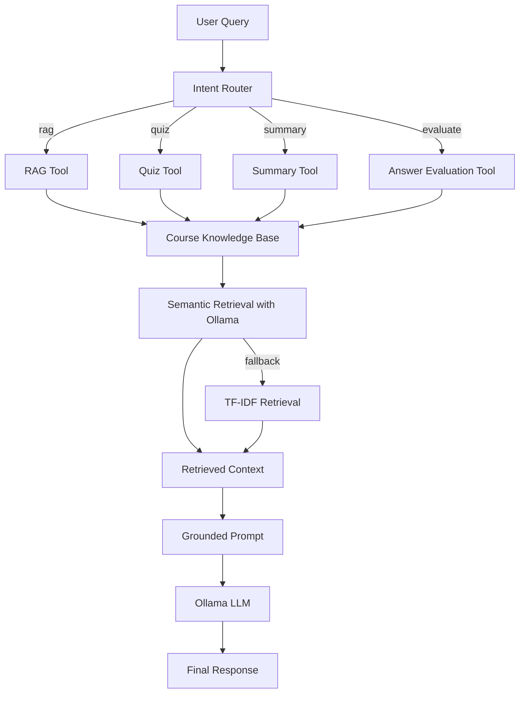

#LearnPilot AI — Agentic AI Learning Assistant

LearnPilot AI is an evolution of a course-specific RAG learning assistant. It retrieves relevant lecture transcript chunks and routes each request to a task-specific tool for **RAG answers, quiz generation, summarization, or answer evaluation**.

The project is intentionally lightweight: the agent workflow is explicit and easy to inspect rather than hiding the orchestration behind a large framework.

## Why this project

A basic RAG application usually follows one fixed path:

`query → retrieve → generate`

LearnPilot AI adds a decision layer:

`query → route to capability → retrieve course context → run tool → generate`

This lets the same knowledge base support several learning workflows while keeping responses grounded in the course material.

## Architecture



## Current implementation

### Agent layer
- Intent routing for four capabilities: `rag`, `quiz`, `summary`, `evaluate`.
- Explicit tool registry.
- Agent state containing query, intent, retrieved context, selected tool, tool result and final response.
- Conditional workflow: route → retrieve → select tool → generate.

### Retrieval layer
- Existing `embeddings.joblib` knowledge base is reused.
- Ollama `bge-m3` embeddings for semantic search when Ollama is available.
- Cosine similarity ranking.
- TF-IDF fallback when semantic retrieval is unavailable.
- Source metadata such as video number, title and timestamps is preserved.

### Generation layer
- Ollama `llama3.2` by default.
- Grounded prompts for each tool.
- Streaming response support in the Streamlit UI.

## Project structure

```text
eduRAG-main/
├── agent/
│   ├── graph.py          # Agent orchestration
│   ├── router.py         # Intent routing
│   ├── state.py          # Agent state
│   ├── tools.py          # Tool registry and tools
│   └── evaluation.py     # Routing evaluation dataset
├── retrieval/
│   ├── retriever.py      # Semantic + TF-IDF retrieval
│   └── prompts.py        # Grounded prompts
├── llm/
│   └── ollama.py         # Ollama client
├── jsons/                # Course transcript chunks
├── app.py                # Streamlit application
├── config.py             # Paths and model configuration
├── preprocess_json.py    # Build embeddings.joblib
├── process_incoming.py   # CLI retrieval test
├── tests/                # Unit tests
├── embeddings.joblib     # Git LFS knowledge-base artifact
└── requirements.txt
```

## Setup

### 1. Install Python dependencies

```bash
python -m venv .venv
# Windows
.venv\Scripts\activate
# macOS/Linux
source .venv/bin/activate

pip install -r requirements.txt
```

### 2. Install and start Ollama

Install Ollama separately, then:

```bash
ollama serve
ollama pull bge-m3
ollama pull llama3.2
```

### 3. Knowledge base

The repository's `embeddings.joblib` is a Git LFS artifact. If it is only a small pointer file after cloning:

```bash
git lfs install
git lfs pull
```

If you do not have the original embedding artifact, rebuild it from the transcript JSON files:

```bash
python preprocess_json.py
```

This requires the `bge-m3` Ollama model.

### 4. Run

```bash
streamlit run app.py
```

## Example requests

### RAG

> Explain CSS box model from my course material.

### Quiz

> Give me 10 MCQs on CSS selectors.

### Summary

> Summarize the lecture on semantic HTML.

### Evaluation

> Check my answer: the CSS box model only contains the content area.

## Configuration

Environment variables are optional:

```text
OLLAMA_BASE_URL=http://localhost:11434
OLLAMA_EMBEDDING_MODEL=bge-m3
OLLAMA_LLM_MODEL=llama3.2
OLLAMA_TIMEOUT=300
```

## Testing

Run:

```bash
python -m pytest -q
```

The tests cover routing, tool prompt construction and end-to-end agent orchestration with a fake retriever.

## Important design choice

This version **does not claim to use LangGraph**. The orchestration is implemented directly in Python so every step is visible and testable. LangGraph can be introduced later if the workflow grows to require persistent graph state, human-in-the-loop execution, retries, or more complex branching.

## Resume-safe project description

> **LearnPilot AI — Agentic AI Learning Assistant | Python, RAG, Ollama, Streamlit**  
> Evolved a course-specific RAG system into a tool-routed learning assistant that selects between grounded Q&A, quiz generation, summarization and answer evaluation; implemented semantic retrieval with Ollama embeddings, TF-IDF fallback, source-aware prompting and modular agent state/tool orchestration.

Only claim technologies that are actually present in the code you can demonstrate in an interview.
